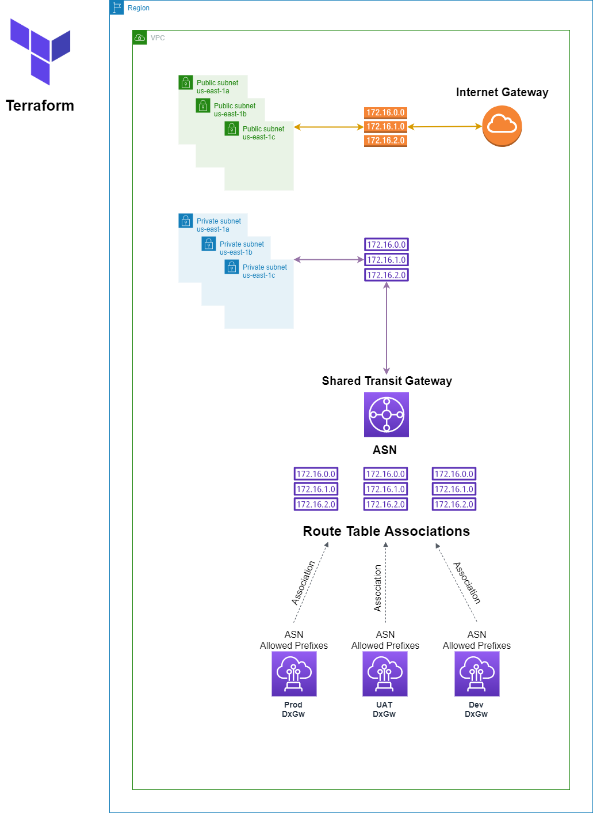

# About
This Terraform code will create a VPC, public and private subnets on all accounts. It will also create a public and a private route table and associated with each subnet. Public route table will use Internet Gateway route while Private Route Table uses a Transit Gateway route.
The Transit Gateway is ONLY created on the Shared account. A VPC attachment is created per account.
One Direct Connect per environment is created on the Shared account and associated with each environment Transit Gateway Route Table.

The purpose of this Terraform code is to create a shared **Transit Gateway** with multiple accounts and associate with Direct Connect Gateway.
Once Terraform completes you should have a main account with a **Transit Gateway** shared with other accounts and **Direct Connect Gateways** associated with **Transit Gateway**.
Please read the full documentation to understand how changes need to be made to work with your environment.

# Requirement
- Terraform 0.13+
- AWS Provider 3.3.0+
```
terraform {
  required_version = ">= 0.13.0"
  required_providers {
    aws = {
      version = ">= 3.3.0"
      source = "hashicorp/aws"
    }
  }
}
```
- AWS CLI 2+
- AWS CLI credential for each account as profile:
```
~/.aws/credentials
[shared]
aws_access_key_id = PSQCLZJDHBV7BDCAQ6G5
aws_secret_access_key = 8569325637841945118820535801/47235969220
[prod]
aws_access_key_id = DOCXCJOAUAHGC9LW4DLG
aws_secret_access_key = 8427812717018081390+44612530667191565688
[uat]
aws_access_key_id = 90KQHDV5Z0CDWJF72C9C
aws_secret_access_key = 7754151002/53647045+69368626664908296006
[dev]
aws_access_key_id = RYSAV9FLULEH4M38E2PX
aws_secret_access_key = 255/606922866105125785+10075185804726390
``` 
- AWS Organization Unit ARN
	- AWS Resource Access Manager ENABLED.
	- Organization Unit with all accounts used.

## Optional Requirement
To include a VIF creation to the code you will need have a Direct Connect setup.

# Accounts
In this example we use 5 accounts, but you can make changes to add or remove the amount of accounts.
- Shared
- Prod
- UAT
- Dev
- VPC

# Resources
Terraform will create several resources on each account. Shared account is the only account that Direct Connect Gateway and the association with Transit Gateway are created.
Terraform will create the following resources on all accounts:
- VPC.
- Public Subnets and Private Subnets.
- Internet Gateway.
- Public and Private Route Table.
- Transit Gateway VPC Attachment.

In additional to the mentioned resources, the Shared account will also include:
- Transit Gateway.
- Transit Gateway Route Tables.
- Direct Connect Gateway.
- Direct Connect Gateway and Transit Route Tables association.

# Notes
## DO NOT MODIFY ORDER
There are 3 variables on the shared-variables.tf file that the order can NOT change.
Variables **accounts**, **dxgateways** and **allowed_prefixes** should be in a key => value format. These variables should maintain the order of the accounts/environments (key). For example **allowed_prefixes**:
```
"Shared" = "10.0.0.0/16"
"Prod" = "10.1.0.0/16"
"UAT" = "10.2.0.0/16"
"Dev" = "10.3.0.0/16"
```
And for example **dxgateways**
```
"Shared" = "65020"
"Prod" = "65120"
"UAT" = "65220"
"Dev" = "65320"
```
As you can see **Shared**, **Prod**, **UAT** and **Dev** are in the same order.

## DO NOT REPEAT ASN
ASN can't be repeated. If you change the ones in the code, make sure they don't repeated.

# Running
- First initialize Terraform.
`terraform init`
- Now run Terraform.
`terraform apply`
Terraform will display everything that will be done, if everything looks correct to you type `yes` and press enter.
It will take several minutes, so go take a break.

# Diagram
